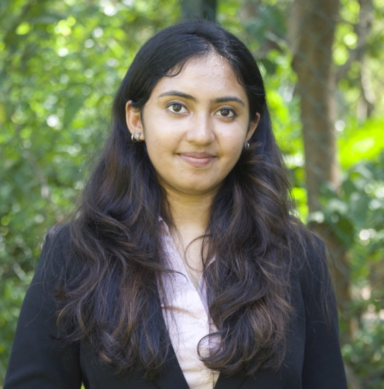

# About me

Hi! 
I'm Nikhita Damaraju, a first year masters student studying Biostatistics at Columbia University Mailman School of Public Health. My professional interests include health informatics and precision medicine. When I'm not busy with my coursework, I enjoy playing the violin and baking.

